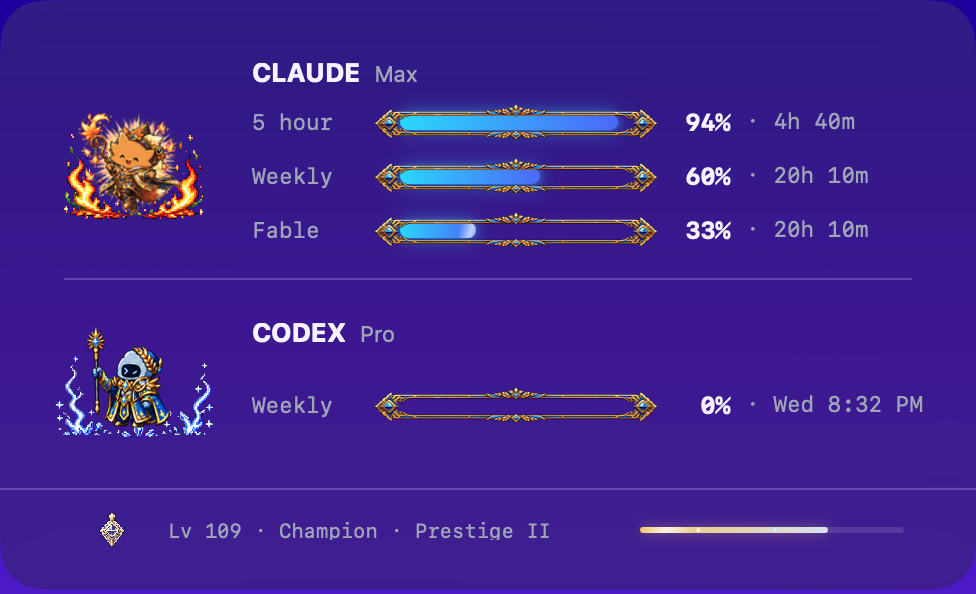

# Mana

An always-on-top macOS widget that turns Claude Code and Codex usage limits into fantasy mana bars.



Mana lives in the menu bar and keeps its expanded party roster available at a glance. Each authenticated provider gets an animated elemental familiar, equal-length usage meters, and complete reset times. Providers you have not authenticated stay hidden. Usage builds local XP, ranks, and prestige without sending progression data anywhere.

## Features

- Menu-bar usage readout: remaining weekly percent per provider, plus the Claude model limit (e.g. `✳ 61·12 ⎔ 54`)
- Native macOS Liquid Glass panel on macOS 26+, with a vibrancy-blur fallback on older systems
- Claude Code session, weekly, and model-specific limits
- Codex weekly subscription usage
- Prestige I-X progression with the highest-earned prestige crest
- Rank-scaled fire/poison and ice/lightning familiar auras
- Update-safe local levels, ranks, prestige, and XP progression
- Local CLI activity indicators
- Smooth, equal-length mana meters with reset times
- Automatic stale-data handling during temporary API failures
- Reduced Motion support
- Menu-bar-only operation with no Dock icon

## Requirements

- macOS (macOS 26 Tahoe or newer for the Liquid Glass panel; older versions get a blur fallback)
- Apple Silicon for the downloadable v0.4.5 binary
- An authenticated Claude Code and/or Codex CLI session

Mana shows only providers with usable local credentials. You can use it with Claude Code, Codex, or both.

## Install

1. Download `Mana-0.4.5-macOS-arm64.zip` from the [latest release](https://github.com/dennisdt/mana/releases/latest).
2. Unzip it and move `Mana.app` into `/Applications`.
3. Right-click `Mana.app`, choose **Open**, then confirm **Open** on first launch.
4. The widget starts hidden. Left-click the mana potion in the menu bar to show or hide it; right-click for the menu. Remaining usage shows next to the icon.

The downloadable build is ad-hoc signed and is not Apple-notarized, so opening it normally for the first time may be blocked by Gatekeeper. The right-click **Open** flow grants the exception without disabling Gatekeeper globally.

When Claude is enabled, macOS Keychain may ask whether Mana can read the `Claude Code-credentials` record. Choose **Always Allow** to avoid a prompt on every refresh.

## How Usage Data Works

Mana polls each authenticated provider once per minute:

- **Claude Code:** `https://api.anthropic.com/api/oauth/usage`, using the OAuth token stored by Claude Code in the macOS Keychain record named `Claude Code-credentials`.
- **Codex:** `https://chatgpt.com/backend-api/wham/usage`, using the access token and account ID in `$CODEX_HOME/auth.json`, or `~/.codex/auth.json` by default.

If a provider request temporarily fails, Mana keeps the last successful values visible as stale data. If credentials are missing or malformed, that provider section is hidden.

## How Progression Works

Progression counts generated output rather than total provider usage:

- **Claude Code:** output tokens only.
- **Codex:** output tokens plus reasoning output tokens.
- Input and cached tokens are excluded.

Each prestige tier requires cumulatively more output than the previous tier. Surplus output carries forward when a level, rank, or prestige threshold is crossed. Hover over the progression footer to see the exact retained lifetime output total.

When upgrading from v2 to v3, Mana rebuilds progression from retained local logs and preserves an immutable v2 recovery file.

## Privacy And Security

- Credential access is read-only.
- Progress is stored locally using migration-safe, atomic saves and remains in place across normal app updates.
- Mana re-reads credentials for each poll and never writes or refreshes them.
- Raw provider usage and token content is not sent elsewhere. Mana persists only local progression state, the retained lifetime output tally, and log cursors.
- Mana does not log raw provider responses or credentials.
- Provider credentials are sent only to that provider's usage endpoint over HTTPS.
- Attack activity is detected locally from Claude and Codex session-log writes once per second; Mana never uploads session content or activity telemetry.
- Mana does not include analytics or an external backend.

Review the credential and polling implementation in [`creds.rs`](src-tauri/src/creds.rs) and [`poll.rs`](src-tauri/src/poll.rs).

## Build From Source

Install the current stable Rust toolchain, Node.js, and the platform prerequisites from the [Tauri documentation](https://v2.tauri.app/start/prerequisites/). Then run:

```bash
npm install
npm run tauri build
```

The macOS bundle is written to:

```text
src-tauri/target/release/bundle/macos/Mana.app
```

## Development

```bash
npm run tauri dev
npm test
cargo test --manifest-path src-tauri/Cargo.toml
```

The frontend uses TypeScript and CSS inside a Tauri 2 shell. Native polling, credential access, menu-bar behavior, and session-write activity detection are implemented in Rust.

To inspect the visual progression without launching Tauri or reading local credentials, run `npm run dev` and open:

```text
http://127.0.0.1:1420/preview.html?rank=godlike&prestige=10&providers=both&outputTokens=18446744073709551615
```

The preview accepts every rank name, `prestige=0` through `10`, `providers=claude|codex|both`, `motion=reduced`, an unsigned 64-bit `outputTokens` value, and `hover=true`. It uses fixed provider usage data and never reads or changes saved progress.

## Known Limitations

- The v0.4.5 release binary supports Apple Silicon only.
- The release is not Developer ID signed or Apple-notarized.
- Claude and Codex usage endpoints are undocumented and may change without notice.
- Mana depends on credential formats written by the corresponding CLIs.

Mana is an independent open-source project. It is not affiliated with or endorsed by Anthropic, OpenAI, or MapleStory/Nexon. The artwork is original and only draws general inspiration from fantasy game interfaces.

## Contributing

Issues and pull requests are welcome. Keep credential handling read-only, avoid logging provider responses or tokens, and include focused tests for behavioral changes.

## License

[MIT](LICENSE) © 2026 Dennis Tran
